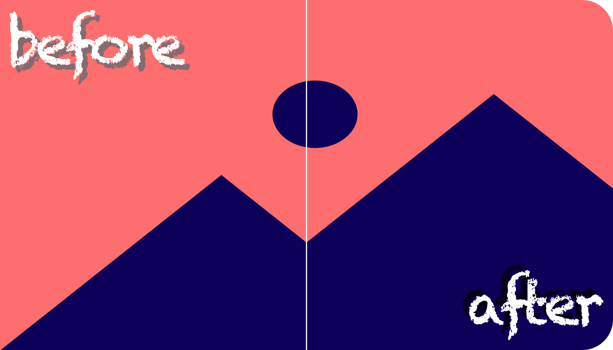

# Image Corner Rounder

A simple graphical user interface (GUI) that allows the user to select an image and generate a new one with rounded corners. The rounded corner image is then saved in the same directory as the original one.



## Requirements

- Python 3
- PIL (Pillow) library
- tkinter library

## Usage

1. Clone the repository or download the script `round_corners_gui.py`.
2. Install the required libraries if you don't have them already:

```
pip install pillow
```

3. Run the script in the terminal or command prompt:

```
python round_corners_gui.py
```

4. Press the "Input Image" button to select the image you want to modify.
5. Press the "Run" button to save the result as a new image.
6. The rounded corner image will be saved in the same directory as the original one and the GUI will close.

## Note

This code is provided as-is and without any warranties. The user is responsible for ensuring that the code meets their needs and for any consequences of using it.
